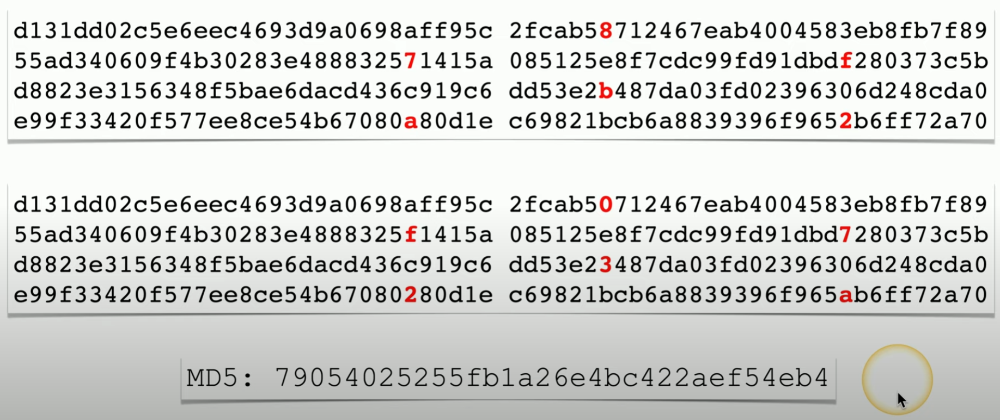

# Cyber Attacks

Plaintext / unencrypted data are easy to steal. *HORRIBLE*.\
**Hashing** adds a layer of security (if no collision) as it encrypts the data with a secure hashing algo (e.g. SHA-256).\
*note*: for one hash algo, one unique input will create one unique output\
**Salting** also adds a layer of security by adding random data before hashing (e.g. same password + salt = diff hash)

 **Spraying attack**
- try to access account from a list of common passwords
- move onto next account and so on 
    
**Brute Force**
- try every possible combination until hash matches
- *online* = very slow and easily stopped by security protocols
- *offline* = download password hash file and compare; lots of computations but won't be locked out
    
**Dictionary Attack**
- use dictionary to find common words / common word list
- try substitute letters
- distribute over many computers to reduce computational time
- *rainbow table* may need diff set of hashes for diff systems

**Birthday attack**
- *premise* - chances of someone sharing a birthday in a class of 23 is 50%
- *hash collision* - similar idea where there can be a same hash value for two different plaintexts
- generate multiple versions of plaintext w/ *brute force* to find matching hashes (large hash output = less chance of collision)
- a match enables the attacker to sign the digital signature with their malicious one
- e.g. December 2008, created MD5 cert that appeared legit based on the hash

    \
    ##### *MD5 Collision*. Identical MD5 output for a slightly different input

**Downgrade Attack**
- force two parties to downgrade to use a less secure encrpytion algo
- e.g. TLS Vulnerability POODLE (Paddle Oracle on Downgraded Legacy Encryption), 2014 - forced clients to fallback to SSL 3.0

Check out [haveibeenpwned.com](https://haveibeenpwned.com/) for something fun!
