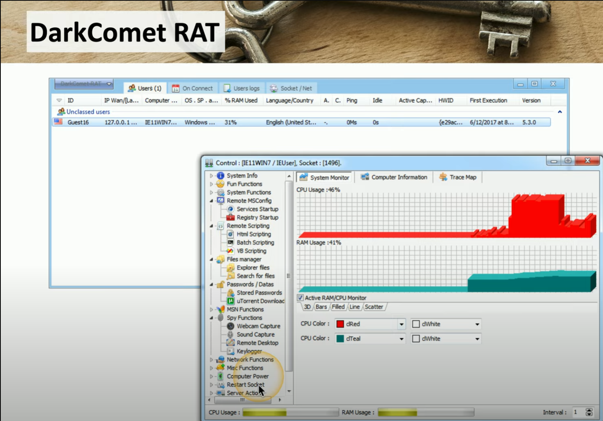

# Malware

Software designed for malicious intent. Point of entry requires user driven action (e.g email link, web pop-up, download, previously installed malware creating a backdoor etc.) or through vulnerabilities in the system (e.g. out of date operating systems / applications)

**Viruses** 
- malware that can reproduce itself 
- user initiated (e.g. click on a link, run infected program etc.)
- *program virus* - part of the application
- *boot sector virus* - exists in boot sector of storage device; when you start OS, virus also runs
- *script virus* - run in os or browser; executes set of commands for the attacker
- *macro virus* - usually run in another app like microsoft office
- *fileless virus* - avoids anti-virus and operates in memory of computer (e.g. click on malicious link > website exploits a vulnerability > launches power shell and downloads payload in RAM > run scripts for malicious intent > add auto-start in registry)

**Crypto-malware**
- installs sotware to mine crytocurrency on victims device (zombie host)
- computer slows down etc.
- can also encrypt user drives / data and force them to pay a ransom for the decryption key

**Ransomware**
- malware that denies user access to system or data until sum of money has been paid
- use a hoax to scare the user into paying a ransom (e.g. fake FBI screen)
- can also lock down the computer so they are forced to pay the ransom for the key

**Worms**
- reproductive malware that can be installed without user interaction
- uses network as transmission medium (hard to contain once it gets through IDS/IPS)
- self propagates quickly
- e.g. WannaCry worm - installed cryptomalware taking adv. of vulnerability in Microsoft Server Message Block 

**Trojan horse**
- software that pretends to be something else (doesn't replicate)
- circumvents existing security
- installs *PUP* (potentially unwanted programs)
- installs *backdoors* 
- installs *RATS* (remote access trojan)

    \
    ##### *DarkComent RAT UI*. Attacker POV of available tools using DarkComet

**Rootkit**
- modifies core system files (kernel)
- invisible to OS
- e.g. Zeus/Zbot malware + Necurs rootkit
- *solution* -  w/ secure boot w/ UEFI that looks for modifications in kernel

**Keylogger**
- installed along with other malware
- captuers user keystrokes and sends it back to attacker
- used to steal credentials etc.

**Adware**
- ads everywhere, literally
- reduces performance problems etc.

**Spyware**
- malware that gathers info about the user (PII etc.)
- monitor user surfing habits, activity, and behaviour
- attackers take adv of this data and monetize it 

**Botnet**
- installed through trojan or OS vulnerability
- user loses control of their computer (becomes a bot)
- many bots > botnet (used for DDoS etc.)
- checks in with C&C and waits for instructions
- keep OS signatures and apps patches updated
    