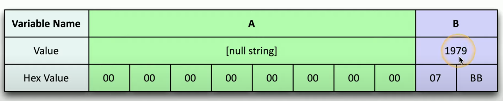
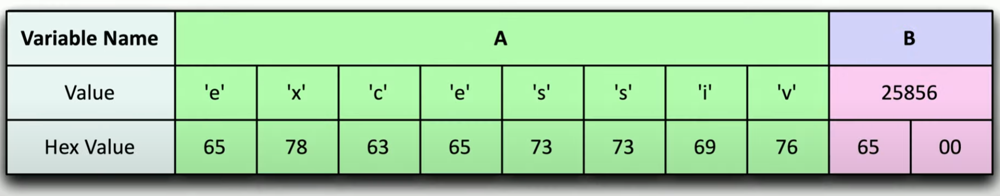

# Buffer Overflow

The amount of data in the buffer **exceeds storage capacity**, causing one section of memory to **overwrite** adjacent section of memory\
Attackers can gain access to system and manipulate applications due to **lack of bounds checking**\
*Replicate + Control* = good buffer attack

**Before**

\

##### *Buffer Overflow Before Attack*. Variable A has no data value. Variable B has 1979 data value.

**After**

\

##### *Buffer Overflow After Attack*. Store string 'e x c e s s i v e' into Variable A where 'e' overflows into to Variable B with Hex value '65'. 

In this example, the changing of Variable B value could allow attackers to gain elevated rights in OS. The string is just a general idea, but the threat actor would modify and tamper with the input to create the necessary data for their attack (e.g. gain access, crash server, DDoS etc.)