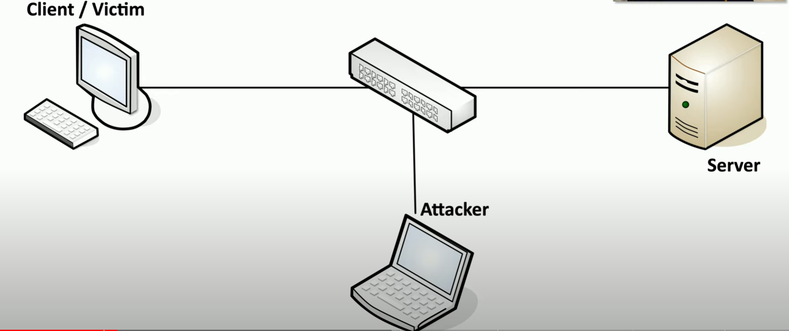
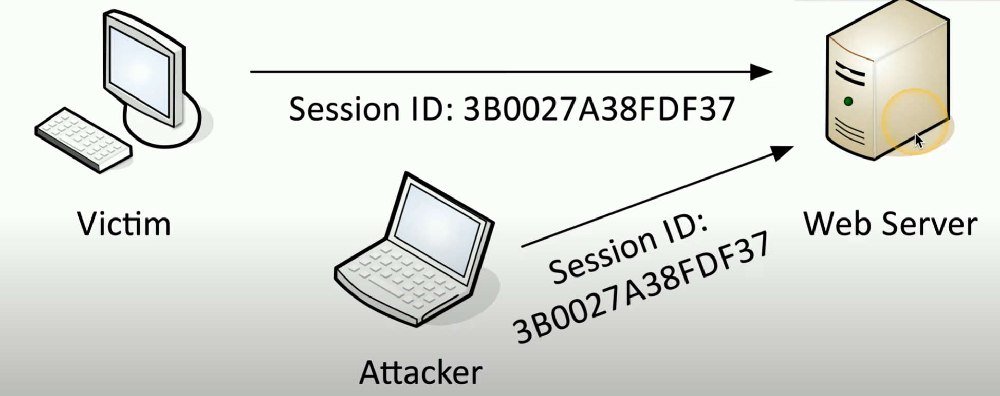

# Replay Attack

Raw network data can be intercepted and stolen when transmitted over the network. Afterwards, it can be *replayed* to impersonate the victim user at anytime.  

- Network tap
- ARP poisoning
- Malware on victim computer

**Pass the Hash**
- obtain hash value of password sent across a network during authentication process
- attacker can *replay* this value to impersonate the user / workstation in a network
- client > transmitted hashed data > attacker intercepts + sent to server

    \

    ##### *Pass the Hash*. Client-Server model where attacker intercepts data in transmission.

**Session hijacking / sidejacking**
- session ID assigned when client first logs in and persists when communicating with service
- attackers can use this ID to impersonate the victim w/o their username / password

    \

    ##### *Session Hijacking*. Attacker intercepts session ID to communicate with server as the compromised user.

**Header manipulation**
- gather session ID info with Wireshark / Kismet from network **OR** exploit network with XSS
- Modify headers with Tamper, Firesheep, Scapy to send to server
- Modify cookies with Cookies Manager+ to impersonate victim

**Prevention** 
- salt and/or encrypt data during transmission to create unique auth hash each time
- secure browser cookies (tracking, personalization, session management / IDs)
- SSL/TLS for secure network communication 
- force HTTPS operation
- use VPN (encrypted tunnel)
