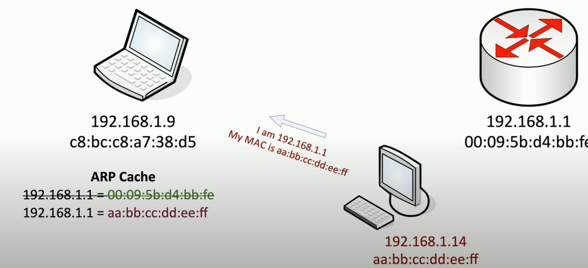

# Network Attacks

**On-path attack**
- redirects your traffic then passes it onto the destination
- man-in-the-middle can view all data transmitted between the source and destination
- must be on the local network
- e.g. *ARP (address resolution protocol) Poisoning* - on path attack on local subnet; no security with ARP

    \

    ##### *ARP Poisoning*. Attacker sends victim the router's IP address to update ARP cache; vice versa with the router so all data goes through the attacker's device.