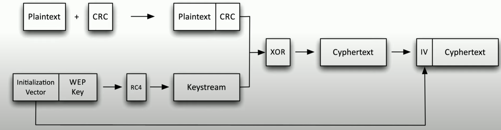

# Randomizing Cryptography 

Cyptography has a large amount of randomization so the encrypted data looks nothing like the plaintext. Now, if there were some obvious correlation, attackers can reverse engineer the result to determine the original value. 

**Crytographic Nonce**
- random / pseudo-random **number** used **once**
- can't be reasonably guessed
- use during login process
    - server sends random nonce
    - calculate password hash with nonce
    - each password hash sent to host is different (to prevent replay attacks)
- e.g. intitialization vector (IV) added to ciphertext

    \
    ##### *IV used in Encryption Cipher*. Adding an initialization vector enables us to randomize the cipher text everytime it is created

**Salt**
- a non-secret, random **value** that is used to ensure plaintext will not consistently hash to the same output value
- each hash gets a different salt
- e.g. always use a salt in password storage