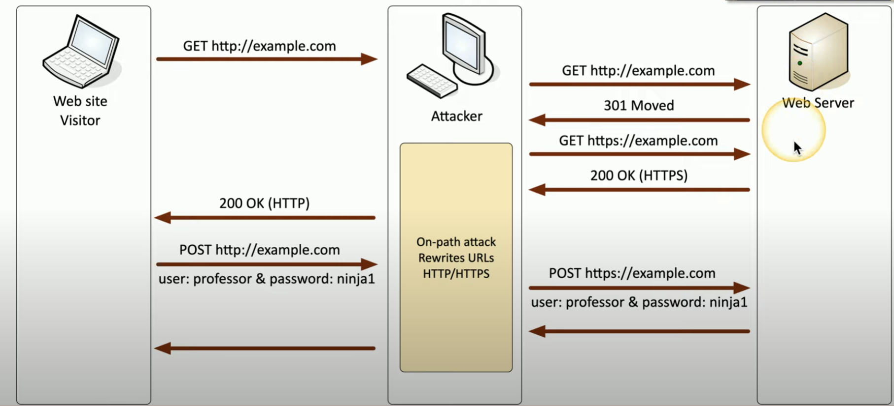

# SSL Stripping / HTTP downgrade

Combines an on-path attack with a downgrade attack. Attacker sits in *between client-server communication* with proxy, ARP spoofing, rogue wifi etc. to *rewrite URLs*. Victim browser page is no longer encrypted (HTTP instead of HTTPS). This is known to work on early SSL and TLS versions. 

**Example scenario of an attacker performing SSL Stripping attack**

1. Web site visitor sends HTTP GET request to server
2. This gets intercepted by the attacker who forwards it to the server
3. Server responds, requesting HTTPS (301 moved status code)
4. Attacker intercepts response and sends HTTPS to the server
5. Encrypted channel between attacker and web server gets established
6. Attacker sends HTTP page to web site visitor (this is not visible to the user!!!)
7. Web site visitor sends POST to login with username & password
8. Attacker intercepts response and forwards it to server over HTTPS channel
9. This can process continue indefinitely and the *attacker can view all data passed between the victim client and server*

\

##### *SSL Stripping*. High level flow of the attack

*Common practices no longer utilize client-server communication with HTTP and web servers do not respond to HTTP*