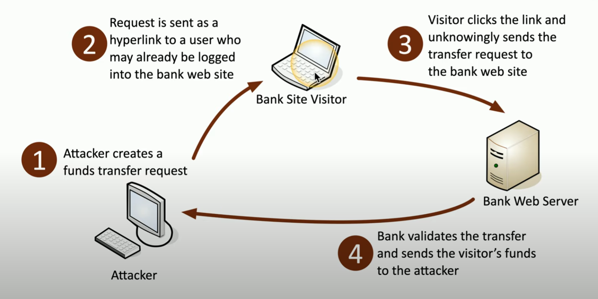

# Web Based Attacks

**Cross site Scripting (XSS)** originating from browser security flaws; info from one site can be shared with another (does not require authenticated session)

- **Non-persistent (reflected) XSS**
    - allows script to run within user input (e.g. search box has appended scripts to retrieve input data)
    - send email to victim > victim clicks URL > directed to malicious webpage > victim input with PII
    - steal info with credentials / sessionID / cookies etc. 

- **Persistent (stored) XSS**
    - victim clicks URL with malicious payload
    - anyone visiting page runs script (no specific target)
    - related PII is stolen
    - e.g. June 2017, Subaru Hack - token did not expire
    - *never click random links bro*

**Code Injection** - adding own info info data stream (HTML, SQL, XML etc.)\
Usually due to poor coding practices - unsanitized input, lack of prepared statements in code etc.

- **SQL Injection**
    - modify SQL requests to run queries on database via UI input (e.g. forms)
    - insert some form of SQL query
    - e.g. PasswordHere' OR '1'='1 

- **XML injection**
    - set of rules for data transfer and storage
    - insert XML metacharacters to determine structure
    - then inject appropriate XML data and tags
    - e.g. inject some form of comment wrapper to comment out data in the XMLdb so the attacker's values are used instead 
    - *can lead to privilege escalation attack*

- **LDAP injection**
    - lightweight directory access protocol
    - commonly used to store data about user auth
    - modify LDAP to manipulate application results

- **DLL Injection**
    - Inject DLL and have the target app run a program
    - Process B **attach** to Process A > **Allocate Memory** for DLL > **Copy DLL** into Process A > Process A **execute** as new thread *with privileges Process B would not have* 
    - More detail in [Prof Messer's Injection Attacks video](https://youtu.be/e4KUdwh8rGo?si=2A_5WPMJpQn7FT7L&t=223)

**Cross Site Request Forgery (CSRF)**
- user tricked into *submitting web request* they did not intend to (client-server data leakage, stolen cookies etc.) 
- *exploits the trust* a web app has for the user > subsequent requests made w/o user consent
- use *cryptographic token* to prevent forgery

    \
    ##### *Cross site request forgery*. Example where attacker steals victim's banking info / funds with CSRF

**Server Side Request Forgery (SSRF)**
- vulnerable web application running on web server (exploit without the client)
- send specially crafted web packets for server to run
- *never trust user input, server should always validate input and response* 
- e.g. march 2019, Capital One SSRF breach - attacker execute commands on Capital One website (misconfigured firewall)

### **XSS vs CSRF?**

|XSS |CSRF |
|:---| :---| 
|Inject malicious code into victim's browser > website executes malicious code | Capitalize on user credentials to force authenticated victim to perform specific actions on their behalf
*Exploits client-trust* (client believes script is coming from server and executes) | *Exploits server trust* (website believe it is the user sending legitimate requests and executes)
Secure practices include using input validation and output encoding | Secure practices include using CRSF tokens 