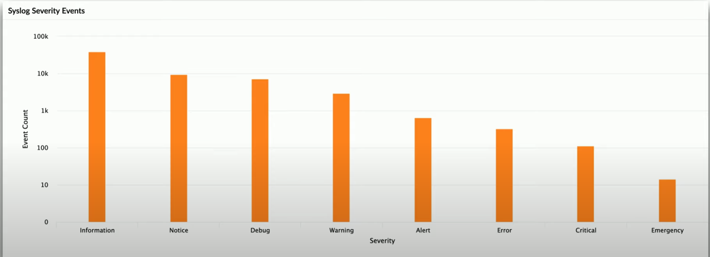

# Security Information and Event Management (SIEM)

System that allows logging of secuity events and infomation to help organizations recognize and address potential security threats and vulnerabilities. More specifically real-time log collection and reporting, including aggregation of security alerts with long-term storage. This enables organizations to identify patterns, perform analysis, and draw correlations given the available data collected over time. 

**Syslog**
- standard for message logging
    - diverse, consolidated log
- central log collector in SIEM
- needs a lot of storage space

**SIEM Data**
- Data inputs
    - server auth attempts
    - VPN connections
    - firewall session logs
    - denied outbound traffic flows
    - network util
- *Recall Google Cybersecurity Course 6, Module 4*
    - logging info such as Time, Username, EventId, Domain, Severity, Message
    - ```<236>1 2022-03-21T01:11:11.003Z virtual.machine.com evntslog - ID01 [user@32473 iut="1" eventSource="Application" eventID="9999"] This is a log entry```
- Packet Capture
    - network packets
    - associated w/ critical alerts
- Security Operations Center (SOC)
    - monitor constant information flow
    - many useful metrics from incoming logs
    - track important statistics
    - automate alerts when problems are found
    - trigger automated responses to contain and mitigate incident
- Security Reports
    - funnel information into logs
    - then create more readable view of data over time
    - e.g. organize in a chart, table etc.

        \
        ##### *Chart of Syslog Severity Events*. Event Count vs Various Severity Type Warnings
- *Log organization important!!*

**Analyzing the Data**
- big data analytics 
- identify patterns that would not normally be obvious
- User and entity behaviour analytics (UEBA)
    - detect insider threats
    - identify targeted attacks
    - catches what SIEM and Data Loss Prevention system (DLP) may miss
- Sentiment analysis
    - how public views the organization
    - bad public opinion = may attract hackers

**SOAR**
- Security orchestration, automation, and response
- *Orchestration*
    - connect and combine many diff tools and information together
    - firewalls, account management, email filters
- *Automation*
    - handle security tasks 
    - eliminate risk of human error
    - leverage speed of computer
- *Response*
    - make changes immediately
    - accurate and fast