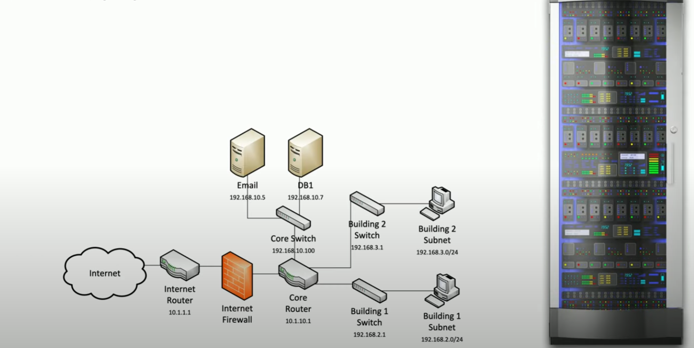

# Configuration Management

The only constant is **change**! New OS, new patches, new application updates, new network modifications, new instances etc.

Always identify an document hardware and software settings so they can be easily modified as changes occur. Additionally, these documentation and processes will be critical in rebuilding and repairing those systems if a disaster occurs. 

**Network Diagrams**
- document physical wires, devices, and racks
- physical data center layout (know how devices are connected and where they are located)
- track individual cabling between racks and systems

    

    ##### *Network Diagram*. General overview of what devices are available on the network and how they are connected.

**Baseline Configurations**
- security of application environment should be well defined
- application instances follow the baseline
- may require constant updates
- *integrity measurements check* = verify if all of the details in documentation matches what is running in the application

**Standard Naming Conventions**
- allows consistency and clarity
- Devices
    - asset tag names / numbers
    - computer names + location / region
    - Serial numbers
    - Racks and panels numbered / lettered
- Networks
    - port labeling
    - cables
- Domain configs
    - user account names
    - standard email addresses

**IP Schema**
- IP address plan or model
    - consistent addressing for network devices
    - avoid duplicate IP addressing
- Locations 
    - number of subnets
    - hosts per subnet
- IP ranges
    - different sites w/ different subnets
    - e.g. ```10.1.xx/24, 10.2.xx/24, 10.3.xx/24```
- Reserved addresses
    - printers, scanners, routers etc.
    - routers / default gateways