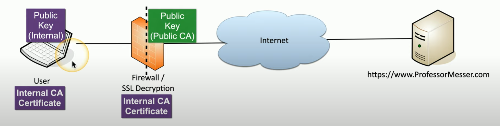

# Managing Security

**Geographical Considerations**
- legal implications
    - in the country?
    - outside of country?
    - regulatory policies involved?
- offsite backups
    - access control?
    - 3rd party?
- offsite recovery
    - in the case of disaster, how can we host data in a diff location?
    - scope of disaster?
    - travel considerations?

**Response and Recovery Controls**
- incident response and recovery become common place
- establish formal process
    - **documentation** is critical
    - identify the attack
    - contain the attack
    - mitigate and limit impact of attack

**SSL / TLS inspection**
- securing data when transmitted over a network
- examine incoming / outgoing data w/ *firewall / SSL decryption + Internal CA cert*

    

    ##### *SSL / TSL Proxy*. To decrypt, analyze, and verify network encrypted traffic between user and server for potential threats.

- SSL / TLS relies on *trust*
    - trusted CA certificates from web server's encryption
    - trust certificate issuer also performed checks to validate against DNS records etc.

**Hashing**
- *message digest* = represent data as short string of text
- one way trip; impossible to recover original message from digest
- digital signature
    - authentication
    - non-repudiation
    - integrity
- no collision (pls)
- e.g. SHA-256

**API**
- protect data sent and received from API calls
- Threats
    - on-path attack
    - API injection
    - Denial of service
- *secure w/ Authentication*
    - limit api access to certain users
    - send requests over secure protocols
- *secure w/ Authorization*
    - should not allow extended access
    - each user has limited role
- Web application firewall (WAF)