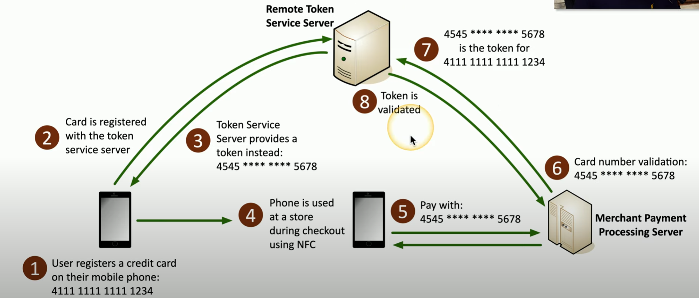

# Protecting Data

An organization's primary job is to **protect their data**. 

**Overview**
- data is everywhere (storage, network, CPU etc.)
- protecting data is difficult
- data permissions vary

**Data Sovereignty**
- data that resides in a country is subject to the laws of that country
- laws may prohibit where data is stored (e.g. GDPR)
- laws may also prohibit moving data out of the country

**Data Masking**
- *data obfuscation* = process of disguising confidential or sensitive dta to protect it from unauthorized access
- e.g. credit cards on receipts only showing last 4 digits (*****1234)
- protects PII etc.
- may only be *hidden from view*
    - data can be stored intact in storage
    - view based on permissions

**Data Encryption**
- plaintext <> ciphertext
- can convert b/w if we have the proper key
- *confusion* = encrypted data very different than plaintext
- *diffusion* = change one character of plaintext changes several characters of ciphertext (vice versa)

**Data At-Rest**
- data on a storage device (e.g. hard drive, ssd, flash drive etc.)
- encypt data on drive 
    - whole disk
    - database
    - file / folder level
- apply permissions to file
    - Access control list
    - authorized user groups etc.

**Data In-Transit**
- data transmitted over network
- network based protection
    - Firewall
    - IPS
- transport encryption
    - TLS (transport layer security)
    - IPsec (internet protocol)

**Data In-Use**
- data actively processing in memory
- usually decrypted b/c it is in use
- attackers can pick decrypted info out of RAM
- e.g. Nov 2013, Target Corp Breach (steal CC by infected cash registers and targeting their RAM)

**Tokenization**
- replace sensitive data with non-sensitive placeholder
    - e.g. SSN 26262 > 
- common with cc processing
    - use temp token during payment
    - prevents attackers from capturing CC to use them later
- no encryption or hashing
- organization not responsible for storing PAN (primary account number)

    

    ##### *Tokenization*. Visualization of tokenization process from User to Merchant via Remote Token Service Server

- *note*: if an attacker steals a token, it is only useful between the merchant and the victim; as such, this will get noticed very quickly and resolved

**Information Rights Management (IRM)**
- control how data is used
- restrict data accecss to unauthorized persons
    - prevent copy and paste
    - control screenshots
    - manage printing 
    - restrict editing
- *limit attackers options* given the user permissions