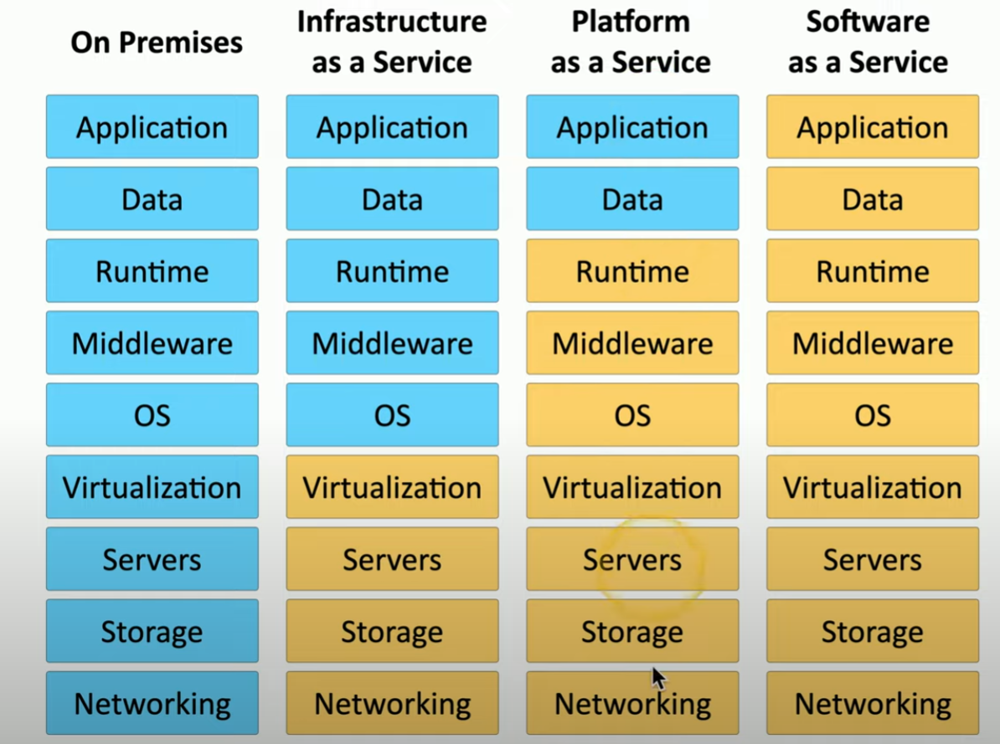

# Cloud Models

**Infrastructure as a Service (IaaS)**
- also called hardware as a service
- outsourcing your equipment
- still responsible for the security
- e.g. Web service provider gives you aserver

**Software as a Service (SaaS)**
- on demand software 
    - no local installation
    - cloud based
    - no config, no application maintenance etc.
- central management of data and apps
- data is 3rd party managed
- e.g. Google Mail

**Platform as a Service (PaaS)**
- no servers, no software, no maintenance team etc.
    - 3rd party handles platform
    - you handle the development
- no direct control of data, people or infrastructure
- hosted by 3rd party
- e.g. SalesForce

**Anything as a Service (XaaS)**
- any service on the cloud 
- delivered over the internet; not locally hosted
- flexible consumption model (no upfront costs or ongoing licensing)
- pretty abstract tbh

**Cloud Models**
- *on premise* managing all applications, data, OS, servers etc. in-house
- *IaaS* moves servers, storage, networking into the cloud
- *PaaS* manage application and data but everything else on the cloud
- *SaaS* everything managed on the cloud

    

    ##### *Cloud Models*. Service comparisons - Client Managed vs Provider Managed.

- charge flat fee or based on use (more data = more cost)

**Managed Service Providers (MSP)**
- 3rd party to handle different aspects of the service
- support:
    - network connectivity management
    - backups and disaster recovery
    - growth management and planning
- *Managed Security Service Provider (MSSP)* = niche MSP for IT security

**On Premise vs Off Premise**
- *On-Premise*
    - in house, local hardware
    - servers in data center in the building
- *Off-premise / hosted*
    - servers may not be in the building
    - 3rd party hardware
    - specialized computing environment

**Cloud deployment models**
- public
- community
    - several orgs share same resource
- private
    - personal virtualized local data center
- hybrid