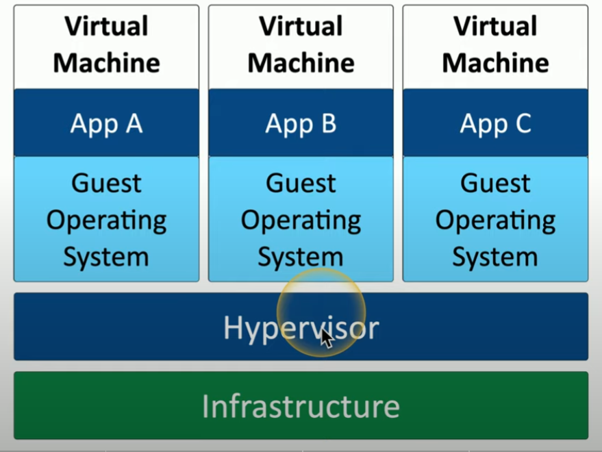
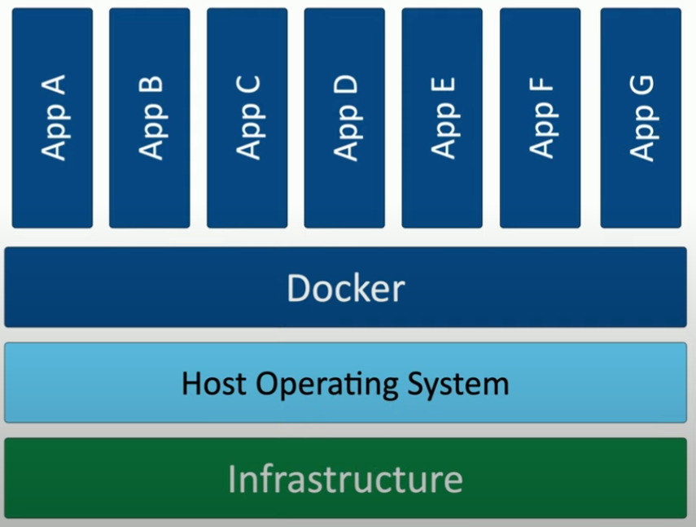
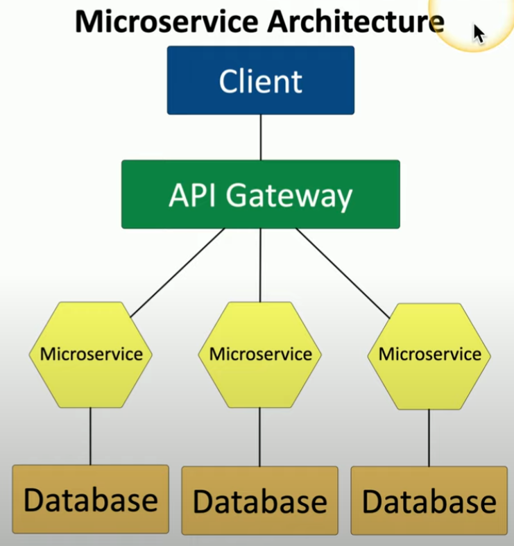

# Designing the Cloud

On demand computing power. Tons of elasticity and scalability. 

**Thin Client**
- basic application usage
- connect to desktop running in the cloud
- run local peripherals (e.g. keyboard, mouse, monitor)

**Virtualization**
- run many diff operating systems on same physical device
-  each application has own OS
    - expensive resource upkeep
    - adds overhead and complexity
- *hypervisor* = software used to run multiple virtual machines on a single physical machine

    

    ##### *Virtualization*. Virtualization visualization.

**Application Containerization**
- container = packages of software that has everything you need to run an application
- self isolated sandbox with central OS
- apps can't interact with each other
- container image
    - maintained standard for portability
    - lightweight usage via host kernel
    - secure separation

    

    ##### *Containerization*. Container's have secure, separated applications centered around Docker.

**Microservices & API's**
- breaksdown monolithic apps (one big thing)
- b/c application contains all decision making processes
    - UI
    - business logic
    - input / output
- large code base = more complexity, difficult to update
- Overview
    - API gateway
    - scalable, just use the microservices you need
    - resilient, outages are contained
    - security and compliance

    

    ##### *Microservice Architecture*. Visualization of how microservices breakdown large applications.

**Serverless Architecture**
- Function as a service (FaaS)
    - individual, autonomous function
    - no local OS reqwuired
- dev deploys stateless compute container (server side logic)
- run events as required
- 3rd party host

**Transit Gateway**
- Virtual private cloud (VPC)
    - pool of resourecs created in public cloud
    - a collection of VPC's created for multiple applications in the cloud
- "router" in the cloud 
- connect through VPN

**Resource Policies**
- assign permissions to cloud resources
- customizable access depending on the type of usage and security level
- e.g. Microsoft Azure (specify which resource can be provisioned in specific region)
- e.g. Amazon (specify resource and what actions permitted over an IP address range)

**Service Integration**
- Service integration management (SIAM)
- many different service providers (but they each work differently so it can be tricky!)
- consolidate the view of all these cloud services on management interface
