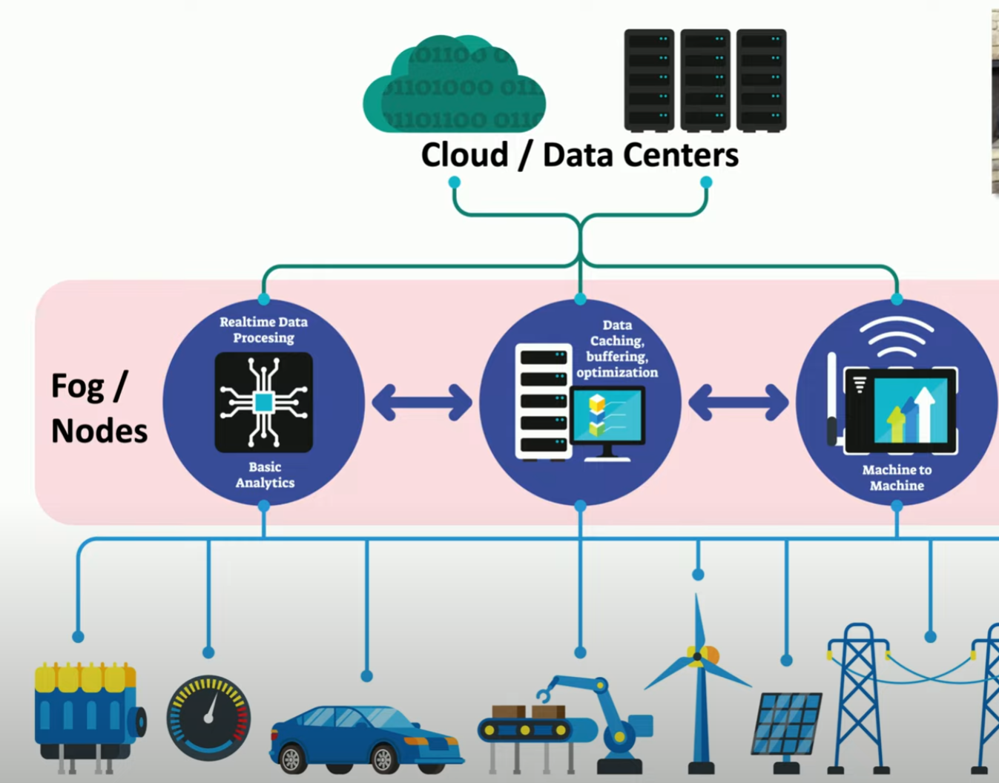

# Edge and Fog Computing

Increasing prevalence of Internet of Things (IoT) devices such as alarm systems, lighting systems, and things found in our home etc. The amount of computing power and data usage is increasing. Therefore, we need an approach to handle such ecosystems without increasing the latency and costs of putting everything on the cloud. 

**Cloud computing**
- always in demand
- instantly available acccess to computing power
- massive data storage capacity
- fast implementation
    - smaller start up costs
    - easily adaptable to change
- **limited by** bandwidth, lantecy, and more difficult to protect

**Edge Computing**
- idea of processing application data on an edge server (close to user)
- process data on device itself
    - no latency / network req
    - increased speed and performance
    - no cloud usage
- e.g. thermostat shouldn't have to communicate with cloud to know the temperature of your home

**Fog Computing**
- a cloud that's close to your data (cloud + IoT)
- distributed architecture and extends the cloud
- immediate data stays local
    - no latency
    - no bandwidth requirements
    - private data never leaves (minimize security concerns)
    - reduce processing and data usage on the cloud
    - long term analysis on the cloud

    

    ##### *Fog computing*. Example multi layered fog computing in use in our daily lives.