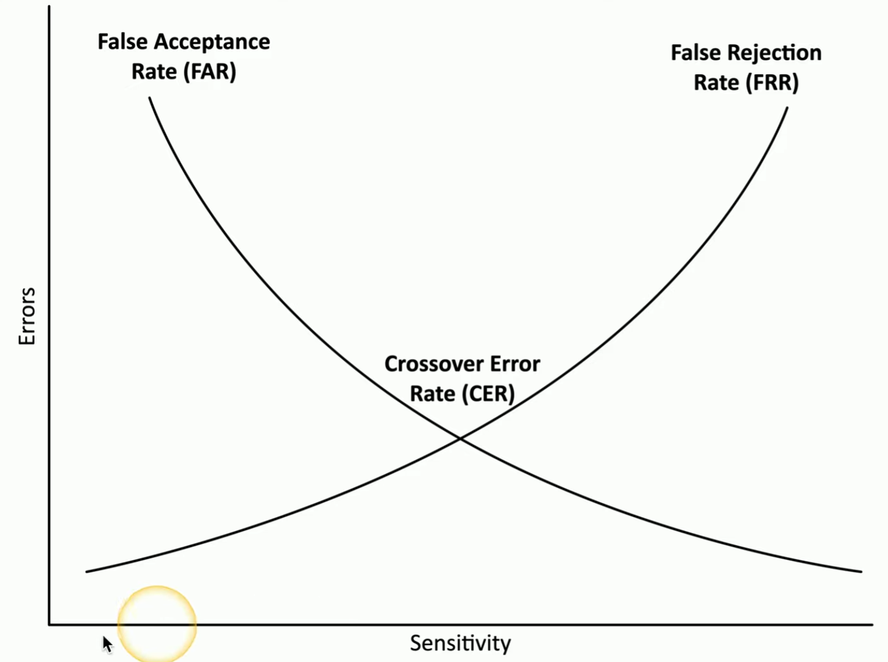

# Biometrics

Bioligical or physical characteristics that can be used to identify individuals. 

**Examples**
- fingerprint scanner (e.g. phones, laptops, door access)
- retinal scanner (back of eye)
- iris scanner (texture, colour)
- voice recognition 
- facial recognition
- *gait analysis* - identify a person based on how they walk
- vascular scanners (blood vessels)

**Biometric Acceptance Rates**
- *false acceptance rate (FAR)* - likelihood that an unauthorized user will be accepted
    - **increase** sensitivity to decrease FAR
- *false rejection rate (FRR)* - likelihood that an authorized user will be rejected
    - sensor is too sensitive
    - **decrease** sensitivity to decrease FRR
- *crossover error rate (CER)* - overall accuracy of biometric system
    - FAR = FRR
    - goal is to adjust sensitivity to **equalize** both values

    

    ##### *Acceptance Rates Visualized*. Sensitivity vs Error Rate where Crossover Error Rate is the sweet spot.