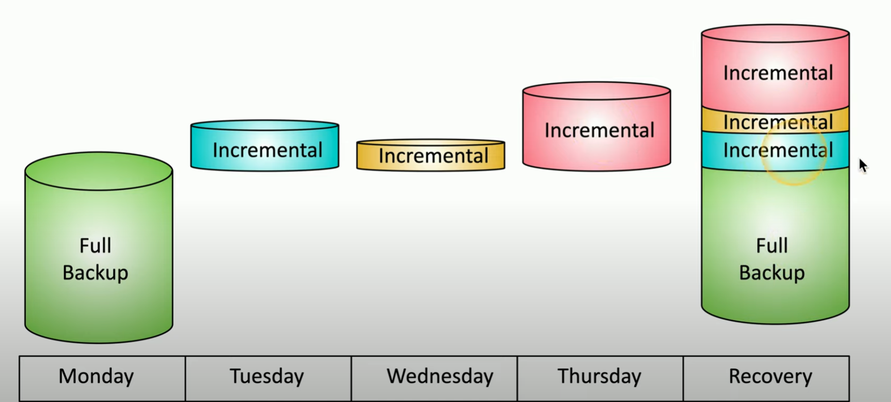
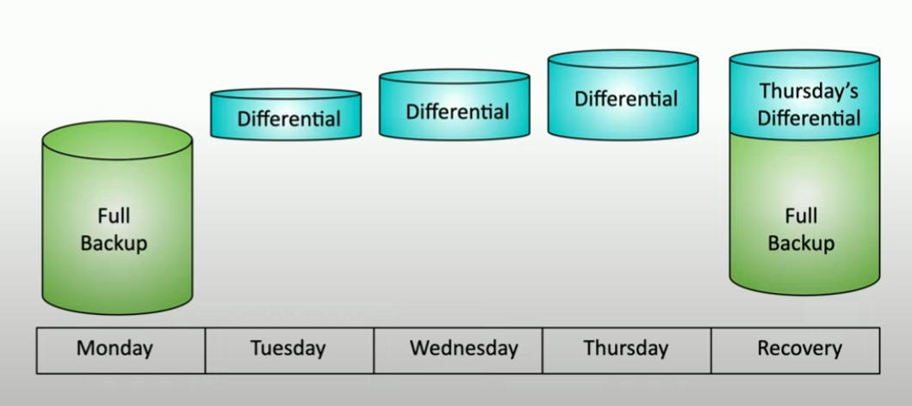

# Backup Types

**File Backups**
- archive attribute
    - set when file is modified
- full back up = everything saved
- incremental = all files changed since last incremental back up
- differential = all files changed since last full back up

**Incremental backup**
- full back up first!!
- subsequent back ups contain data changed *since last full + incremental back up* (smaller size)
- *restoration* requires full + every incremental back 
- slow restoration time
- clears archive attribute each time

    

    ##### *Incremental Backup*. An incremental backup done over a typical Monday - Friday week. The Recovery stage includes all backups. 

**Differential Backup**
- full back up taken first!!
- subsequent backups contain data changed *since last full back up to current* 
    - grows larger as data is 
- *restoration* requires full back up and last differential back up
- does not clear archive attribute
    - b/c back up is performed again on last differential back up

    

    ##### *Differential Backup*. A differential backup done over a typical Monday - Friday week. The Recovery stage includes all backups. 

**Backup Media**
- *magnetic tape*
    - e.g cassette etc.
    - sequential storage
    - various storage space (e.g. 100GB to TB)
    - easy to ship and store
- *disk*
    - faster than magnetic tape
    - deduplicate and compress (eliminates redundant info; more efficient storage)
    - hard drives prices decreasing
- *Image*
    - exact duplicate of system at particular point in time
    - can keep off site
    - good for system restoration

**NAS vs SAN**
- *Network attached storage (NAS)* = connect to shared storage device across network
    - file level access
    - complex when files are large
- *Storage Area Network (SAN)* = local storage devices connnected w/ dedicated storage network
    - block level access (only portion of disk)
    - efficient read and write
- **lots of bandwidth req**

**Other Backups**
- *cloud*
    - backup to remote device in cloud
    - support many devices
    - bandwidth limitations
- *image*
    - capture exact replica of file system
    - restore everything on partition etc.

**Backup Locations**
- *offline*
    - local devices
    - fast and secure
    - must be protected and maintain
    - potentially offiste storage
- *online*
    - always accessible
    - constant updates
    - cloud based / 3rd party
