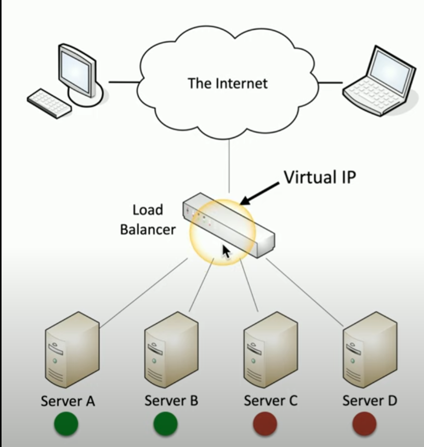
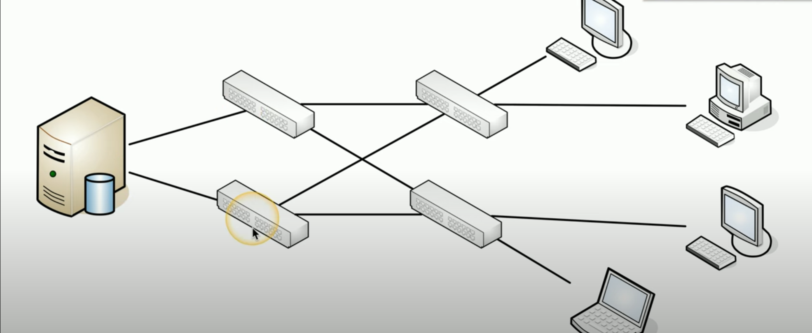

# Network Redundancy

**Load Balancing**
- helps maintain uptime and availability on network
- some servers are active, others are stand-by
- if active server fails > passive server takes it's place
- also caches what server was active for a particular user to increase speed

    

    ##### *Load Balancer Visualized*. Load balancer decides what server is able to provide the service.  

**NIC teaming**
- use multiple network interface cards
- *load balancing / fail over* (LBFO)
    - aggregate bandiwdth
    - provides redundant paths
- use multiple network adapters
    - integrate with switches
    - act as one unit
- *port aggregation*
    - higher bandwidth and throughput between server and last switch
    - can configure multiple switches for redundancy

    

    ##### *Port Aggregation*. Sever with two NIC connected to multiple switches, both configured with port aggregation. 

