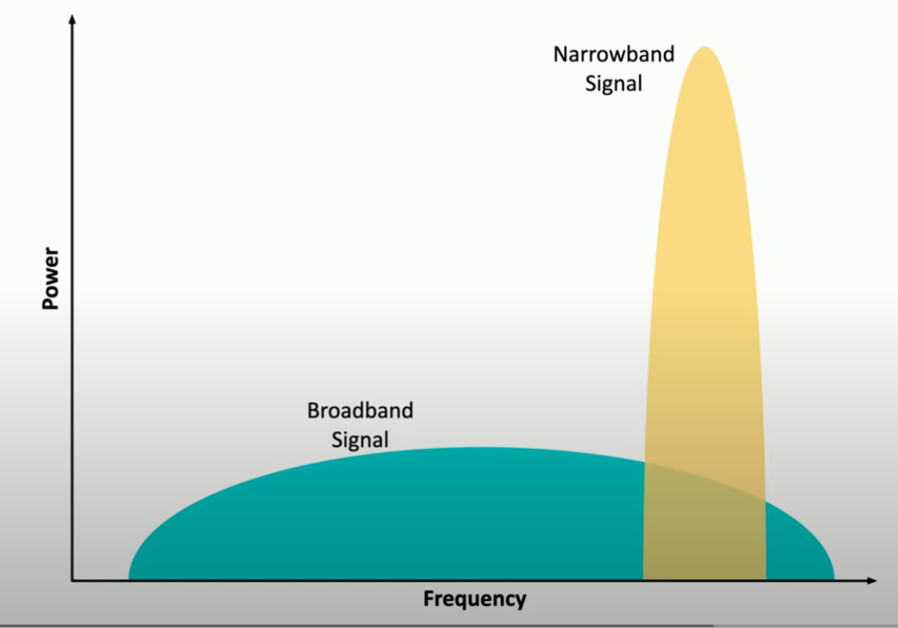

# Embedded Systems Communication

Overview of communication channels:
- 5G
- SIM
- Narrowband
- Baseband
- Zigbee

---

**5G**
- 5th generation cellular networking
- launched 2020
- significant performance improvements
    - high frequency transmission
    - over 10 gigabit (gb)/s
- impact on internet of things devices
    - lower bandwidth constraint
    - larger data transfers
    - faster monitoring
    - additional cloud processing

**Subscriber Identity Module (SIM)**
- universal integrated circuit card
- provide info to cellular network
    - *international mobile subscriber identity* (IMSI)
    - device auth info
    - device contact info
- more embedded systems = more SIM cards

**Narrowband**
- communicate analog signals over narow range of frequencies
- useful for long distance communication (e.g. oil field sensors)
- high resistance to signal noise and interference
- efficient bandwidth usage

    

    ##### *Narrowband Frequency Communication*. More efficient bandwidth usage at the cost of lower efficient power usage. 

**Baseband**
- single cable with digital signal (e.g fiber or copper cable)
- uses all bandwidth (0% or 100%)
- bidirectional communication but *one way at a time*
- e.g ethernet standard

**Zigbee**
- internet of things communicating w/ wireless network
- e.g. Open standard IEEE802.15.4 PAN 
- alternative to wifi and bluetooth
    - longer distance
    - less power consumption
    - mesh network of zigbee devices
- e.g amazon alexa controlling different deviecs
- use ISM band (industrial, scientific, medical)
    - 900Mhz
    - 2.4 Ghz