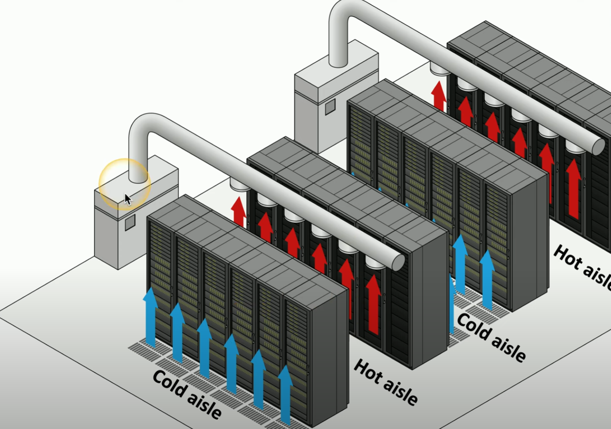

# Secure Areas

Often we need to make sure threat actors cannot access our important assets through the network. It is also important to **physically** protect our data as well. This includes offline data and backups as a security concern highlight. 

**Air Gap**
- physical separation between networks
- prevent individuals from one network to gain access to another network
    - e.g. stock markets, power plants, airplanes

**Vaults and Safes**
- secure reinforced room to store back up / confidential data
- commonly onsite
- varying levels of space

**Hot and Cold Aisle**
- lots of equipment in data centers that generate heat
- regulate temperature of equipment (e.g. don't want servers overheating)
- seperate room into hot and cold aisles
    - blow cool air in single direction
    - hot air captured and sent back to ventilation system in hot aisle
    - heated air then recycled back to cold aisle

    

    ##### *Hot and Cold Aisles in Server Room*
