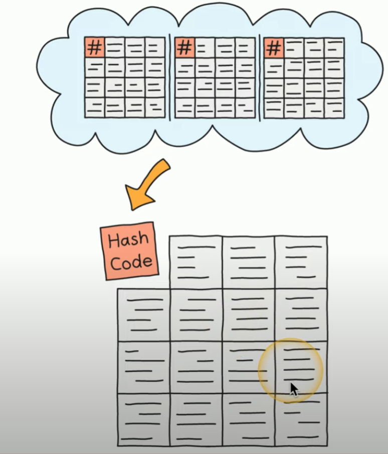

# Blockchain

A distributed ledger - way to keep track of distributed event. Common use in crypto.

e.g. Payment processing, Digital ID, Supply Chain, Digital Voting

**Process**
1. Transaction Requested (e.g. btc transfer)
2. Transaction sent to every node in decentralized network for *verification*
    - each device maintains the ledger
3. Verified transaction added to new block of data containing other recently verified transactions
    - block contains a number of verified transactions
4. Calculate hash from previous blocks of transaction data in Blockchain
    - added to new block
    - used to validate the authenticity of the block

    

    ##### *A Block in Blockchain*

5. Add new complete block to the blockchain
    - copied to all devices maintaining the ledger
- Any modifications can be verified against other block and their hashes
    - Proof of work!
- Previous blocks **cannot** be changed