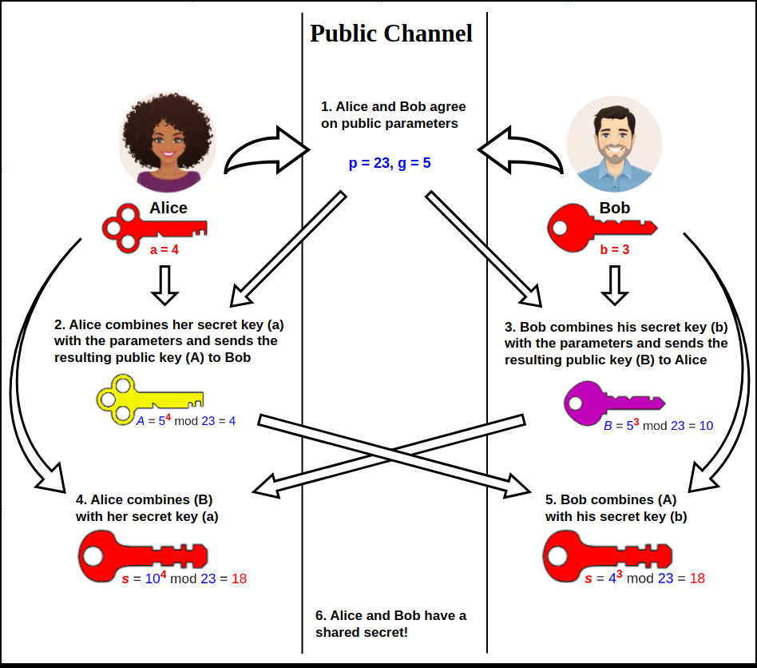

# Crytographic Keys

Crypto Algorithm is usually a known entity. Having an open process is good - nothing to hide. Everything about it can be shared except for the private key. 

**Key Strength**
- larger keys tend to be more secure
- *the bigger the better right?*
    - prevent brute force attacks
- complex calculation of prime numbers

**Key Exchange**
- how to transfer encrpytion key acrross  *insecure* medium?
- *out-of-band* key exchange (outside of network)
    - telephone
    - courier
    - in person etc.
- *in-band key* exchange (on network)
    - protect key w/ additional encryption
    - use asymetric encryption to deliver symmetric key

**Real time Encryption / Decryption**
- fast AND secure
- asymmetric encryption to share symmetric key
    - encrypt symmetric key w/ public key
    - server decrypts shared key
    - server uses this symmetric key (session key) to encrypt data
- change session keys often!

**Diffie Helman Key Exchange**
- method to securely exchange crypto keys over public channnel
1. Alice and Bob agree on base *g* and modulus *p* 
2. Alice chooses *secret integer* a and sends Bob A = ga mod p 
    - Alice computes public key A
3. Bob chooses *secret integer* b and sends Alice B = gb mod p
    - Bob computes public key B
4. Alice computes s = Ba mod p
5. Bob computes s= Ab mod p
6. Because **(gamod p)b mod p = (gbmod p)a mod p**

    

    ##### *Diffie-Hellman Key Exchange Diagram (Wikipedia 2024)*

**Traditional Web Server Encryption**
- SSL/TLS protects web server comms w/ encryption keys
- server has *same* private RSA key pair
- *risky single point failure!* 
    - gain server private key + capture traffic = decrypt all their data

**Perfect Forward Secrecy (PFS)**
- don't use server's private RSA key
- use Elliptic Curve or Diffie-Hellman
- each session key is unique
- more computing power req