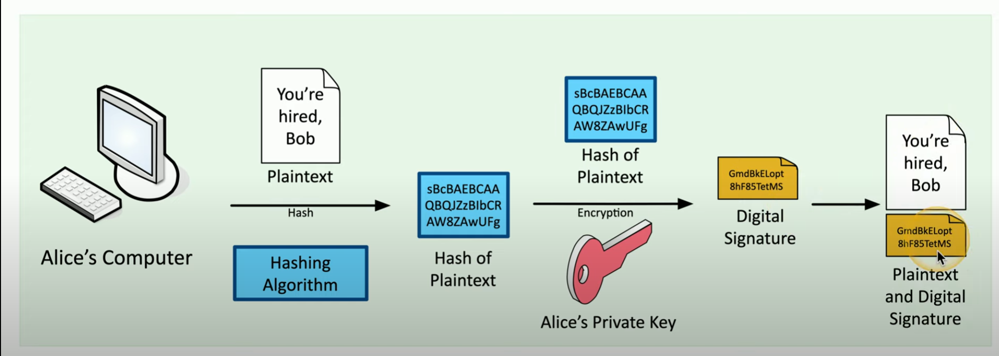
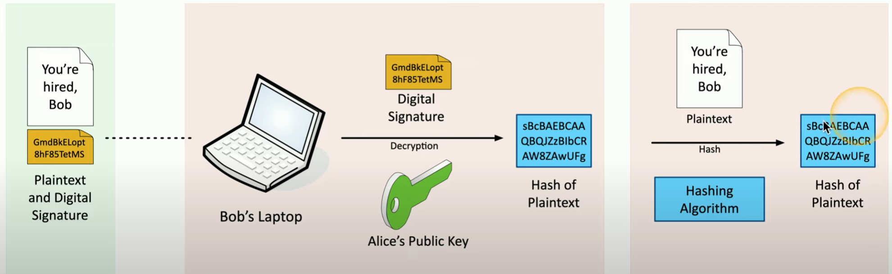

# Hashing and Digital Signatures

Algorithm to create some sort of unique fingerprint associated with that file / data.  

**Hashes**
- represent data as short string of text
- one way trip ; cannot recover original message from digest
- used to verify integrity
    - performing same hash on same file should always produce same result
- used w/ digital signatures
    - authentication
    - non repudatiation
    - integrity
- *hopefully!* no collision
- e.g. SHA256

**Collision**
- hash functions
    - input of any size
    - create fixed size string
    - get unique message digest
- e.g. MD5 has collision problem
- two different inputs > same hash value
- *this is BAD!*

**Practical Hashing**
- verify a downloaded file
    - compare downloaded file hash with posted hash value
    - they should be identical
- Password storage
    - store salted hash
    - compare hashes during authentication process

**Salting**
- add random salt to password when hashing
- *Hash(password + random salt) = unique hash value*
- every user gets their own random salt
- combat against rainbow tables
- slow down brute force process

**Digital Signatures**
- *integrity* = prove message was not changed
- *authentication* = prove source of message
- *non repudiation* = verify signatue is not fake
- sign with *private key*
- verify with *public key*
- Digital Signature = *Encrypt(Hash(Plaintext))*
- **Digital Signature Example**
    - Alice hashes plaintext
    - Encrypts Plaintext with her private key
    - Sends this digital signature + plaintext to Bob

    

    ##### *Alice Encrypts Her Hashed Message creating her Digital Signature*

- Bob can verify Alice's message
    - Decrypt digital signature with Alice's public Key
    - Retrieve a hash message
    - Hash the same plaintext with same Hashing Algo
    - Compare the hash values - *they should be the same!*

    
    
    ##### *Bob can verify Alice's message by comparing the hash values*
    