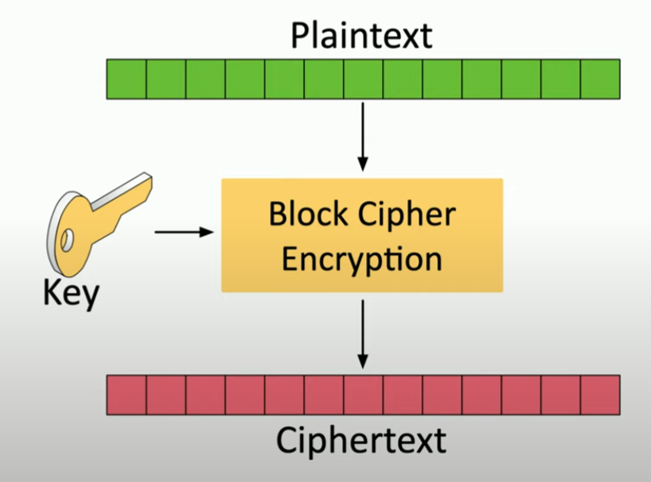
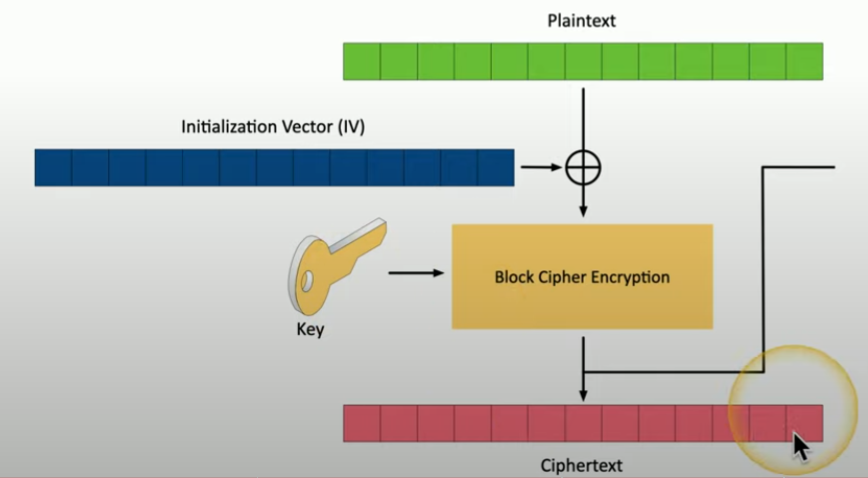
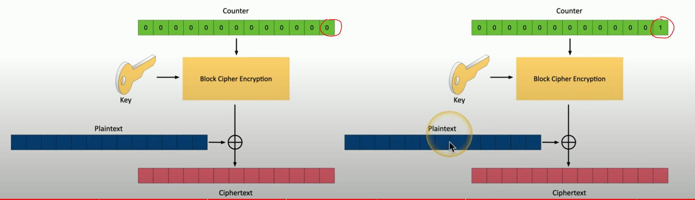

# Stream and Block Ciphers

**Stream Ciphers**
- encryption to transform plaintext into code, one bit or byte at a time
    - *commonly combined with XOR*
- high speed
- low hardware complexity
- same key can encrypt and decrypt
- e.g. use with symmetric encryption
- combine w/ initialization vector (IV) each time (random start)

**Block Ciphers**
- encrypt fixed length groups (block)
    - 64 bits
    - 128 bits
    - pad added to short blocks
- split plaintext into blocks
- *Electronic Code Block (ECB)*
    - simplest encryption mode
    - each block usesame single key
    - identical plaintext blocks > identical ciphertext block

    

    ##### *ECB, Block Cipher Diagram*

- *Cipher block chaining (CBC)*
    - plaintext block XOR w/ *previous* ciphertext block (as IV)
    - adds additional randomization
    - use IV for first block

    

    ##### *Cipher Block Chain, Block Cipher Diagram*

- *Galois / Counter Mode (GCM)*
    - plaintext any size
    - increment counter for next block
    - no IV required
    - min latency, no min operation overhead

    

    ##### *Counter, Block Cipher Diagram*
