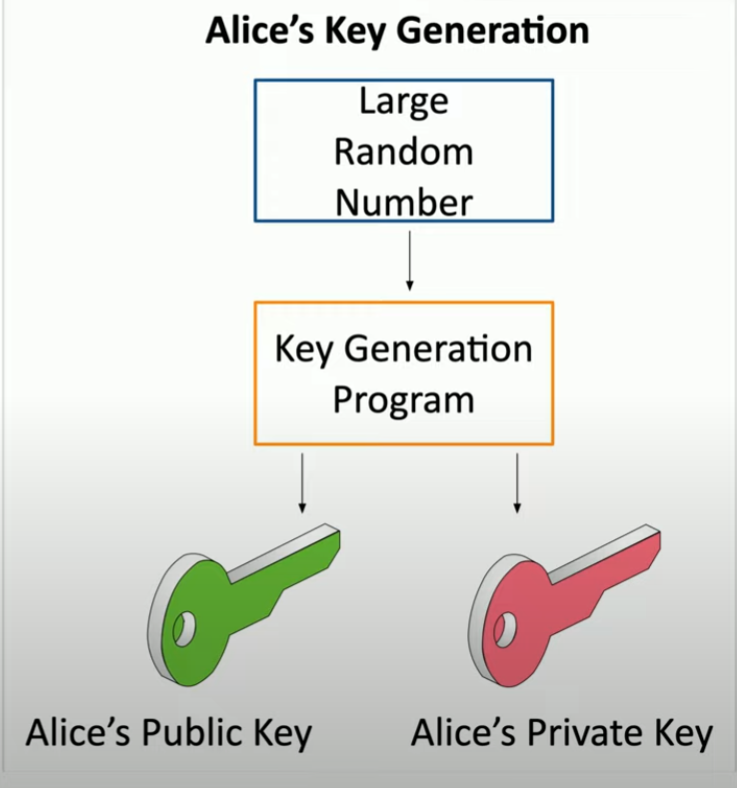

# Symmetric and Asymmetric Cryptography

**Symmetric Encryption**
- encrypt and decrypt with *single, shared key*
- secret key algo
- fast to use and less overhead
- poor scaling
- can use asymmetric encryption to *transfer* symmetric key

**Asymmetric Encryption**
- public key cryptography
    - two or more mathematically related
- private key
    - *decrypt* with this
- public key
    - *encrypt* with this
- *key pair*
    - build both public and private key at same time
    - e.g. randomization, large prime numbers etc.

    

    ##### *General process to generate public and private keys for cryptography*

- e.g. Bob wants to send encrypted message to Alice
    - Combine plaintext + Alice's public Key
    - Encrypt ciphertext
    - Send ciphertext to Alice
    - Alice decrypt with private key
    - Obtains plaintext

- Applications for Symmetric Key
    - Bob combine private key with Alice public key to create Symmetric Key
    - both sides can create identical Symmetric Key *without sending info*

**Elliptic Curve Cryptography (ECC)**
- type of asymmetric encryption
- use of prime and binary curves
- uses smaller keys / storage than regular asymmetric encrpytion
- e.g. encryption in mobile devices
